# Screenshots
## DK4OTRS-UBInventory

## DK4Znuny-QuickDelete

## MRBS-OTRS

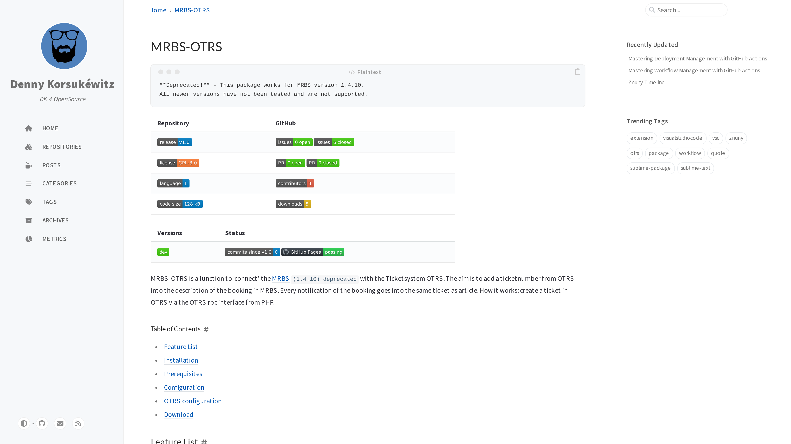
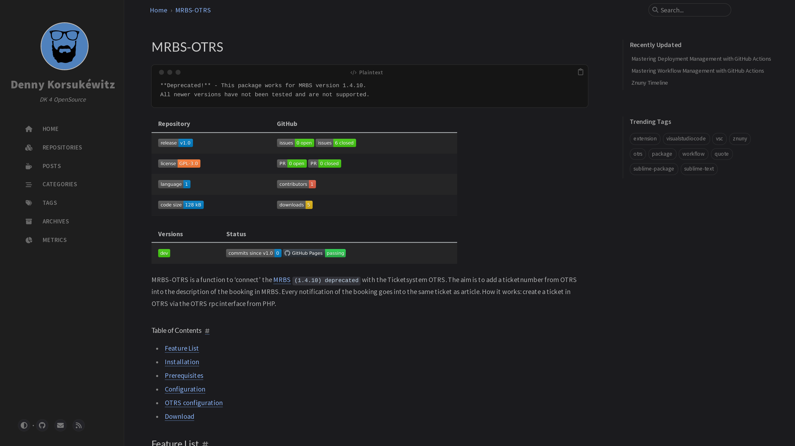

## Sublime-GitHubFileFetcher

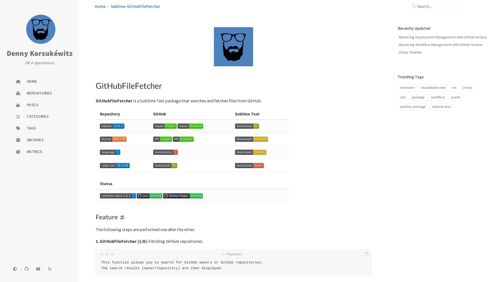
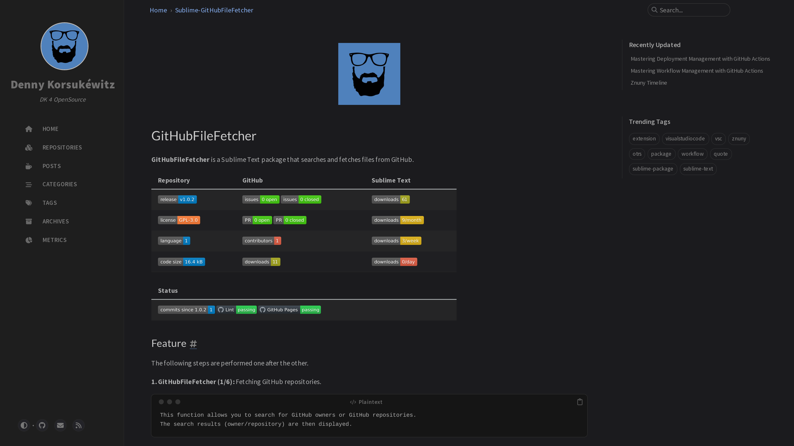

## Sublime-QuoteWithMarker

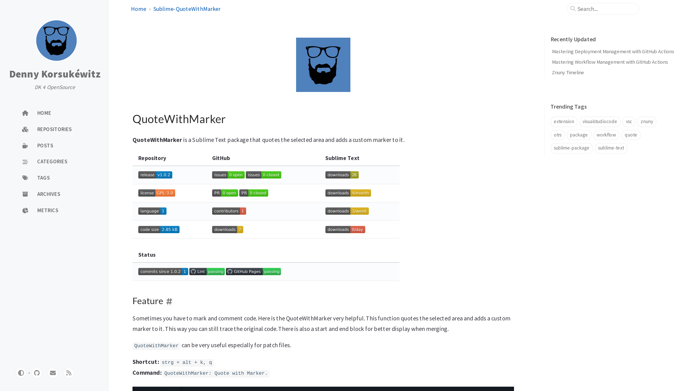
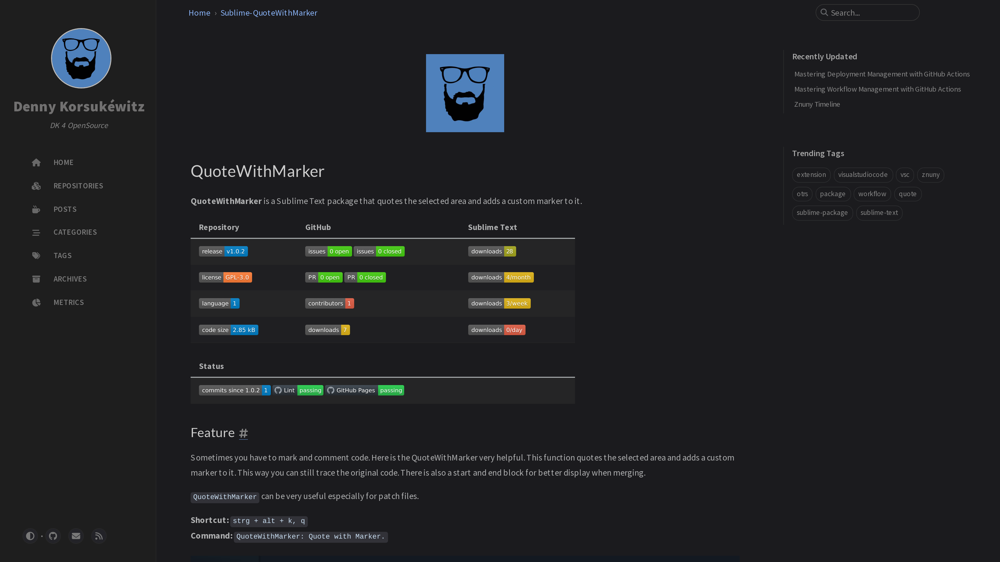

## VSCode-AddFolderToWorkspace

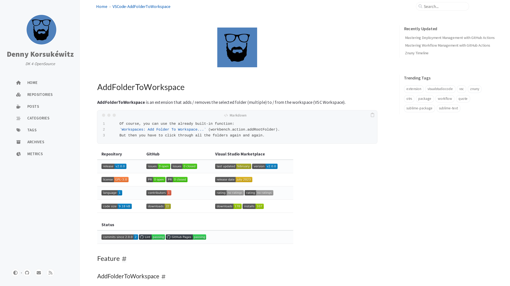
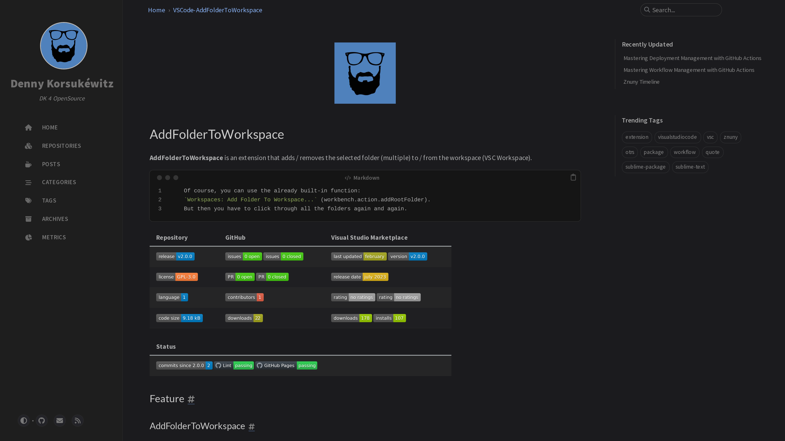

## VSCode-GitHubFileFetcher

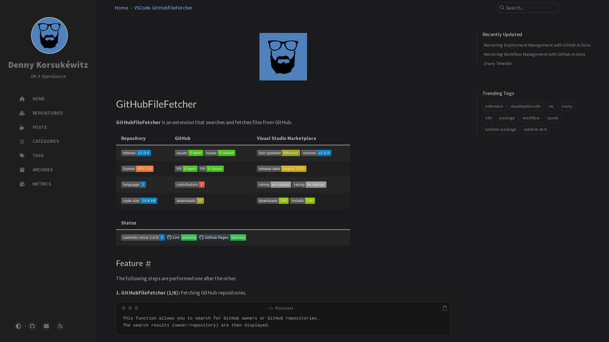

## VSCode-QuoteWithMarker

## VSCode-Znuny

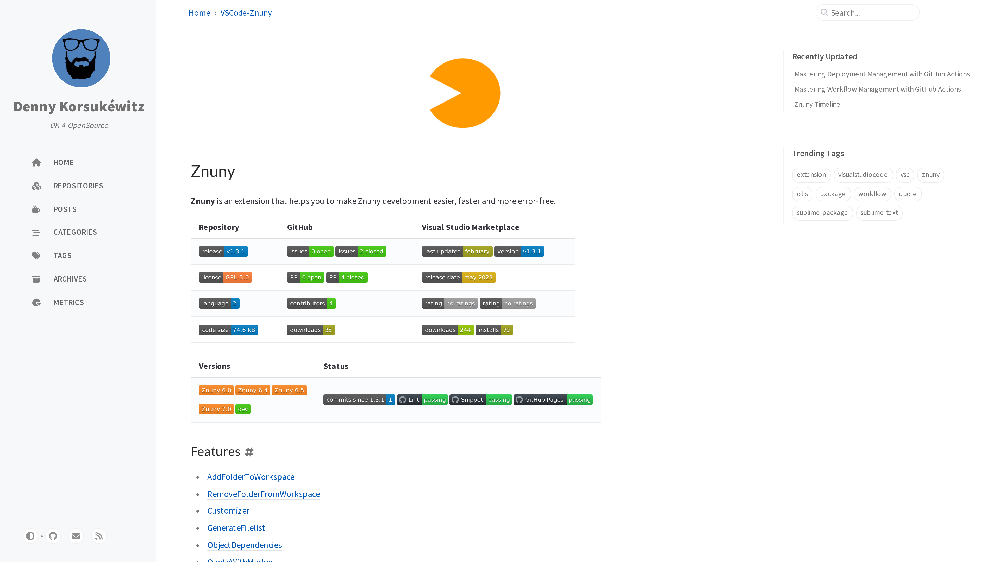
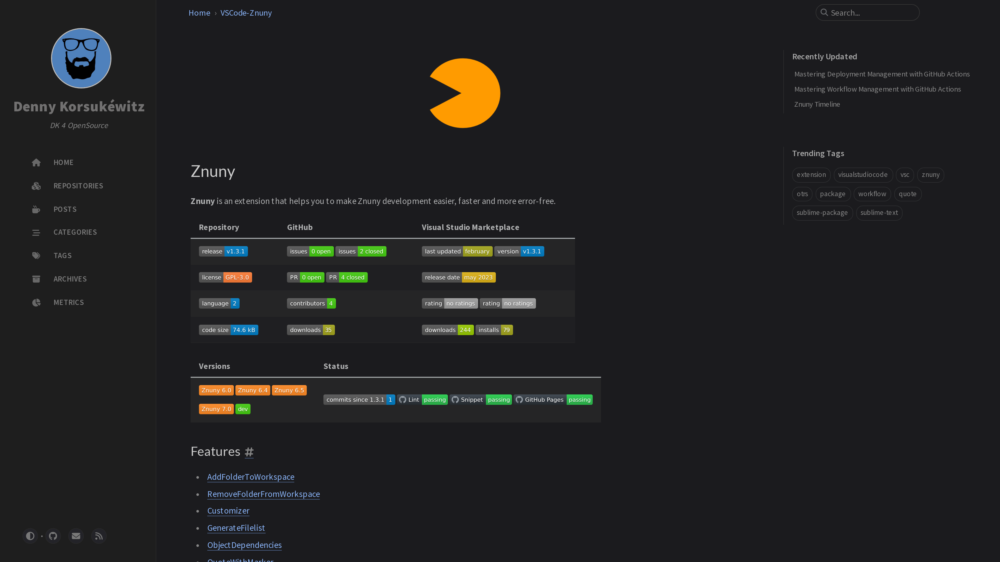

## Repositories

## Posts

## Categories

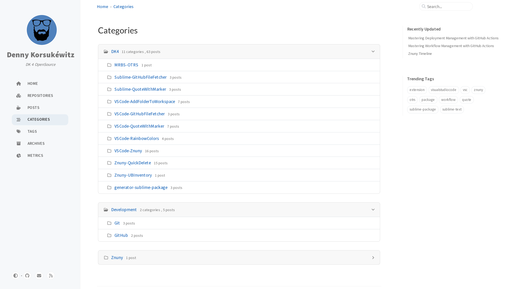
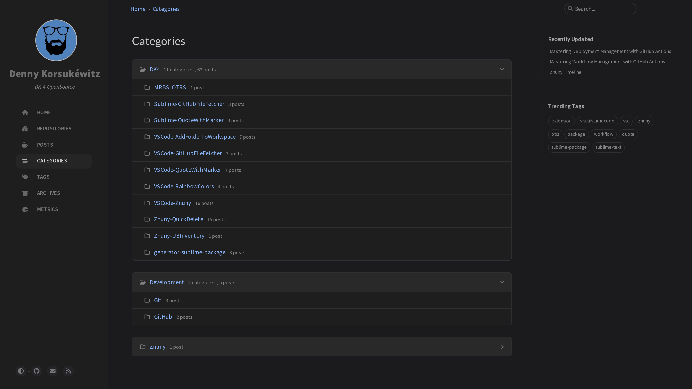

## Tags

## Archives

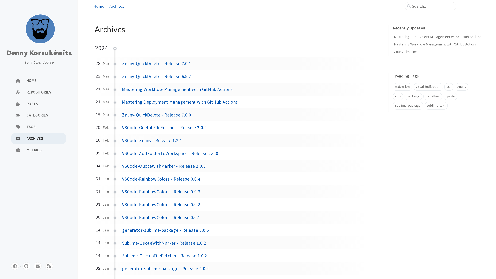
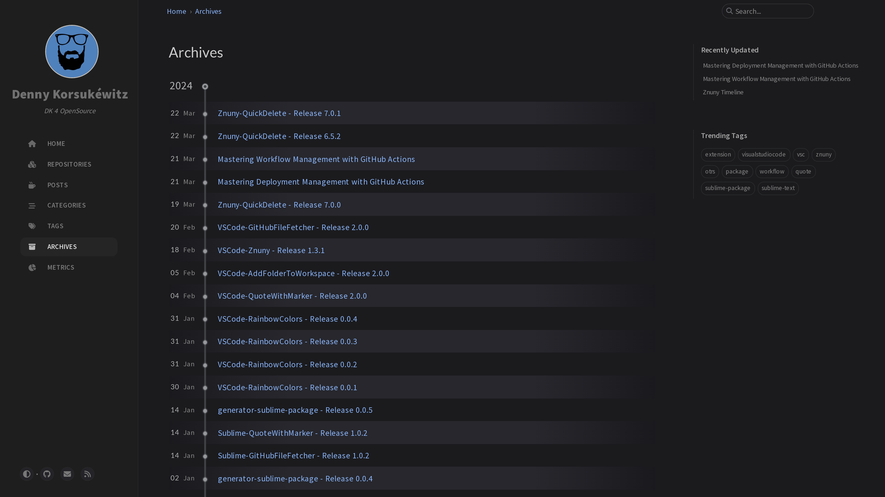

## Metrics

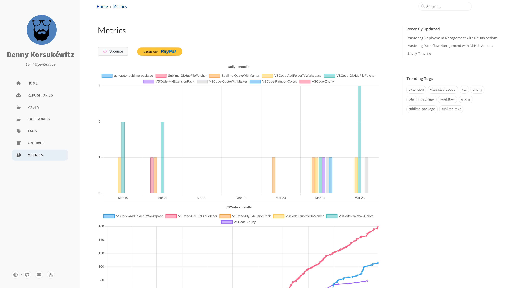
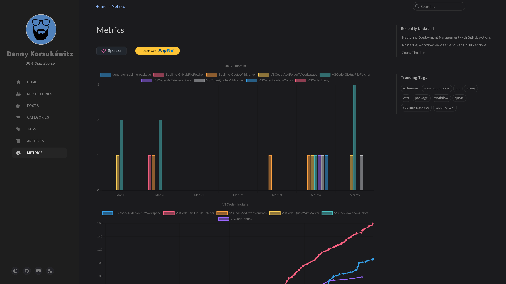

