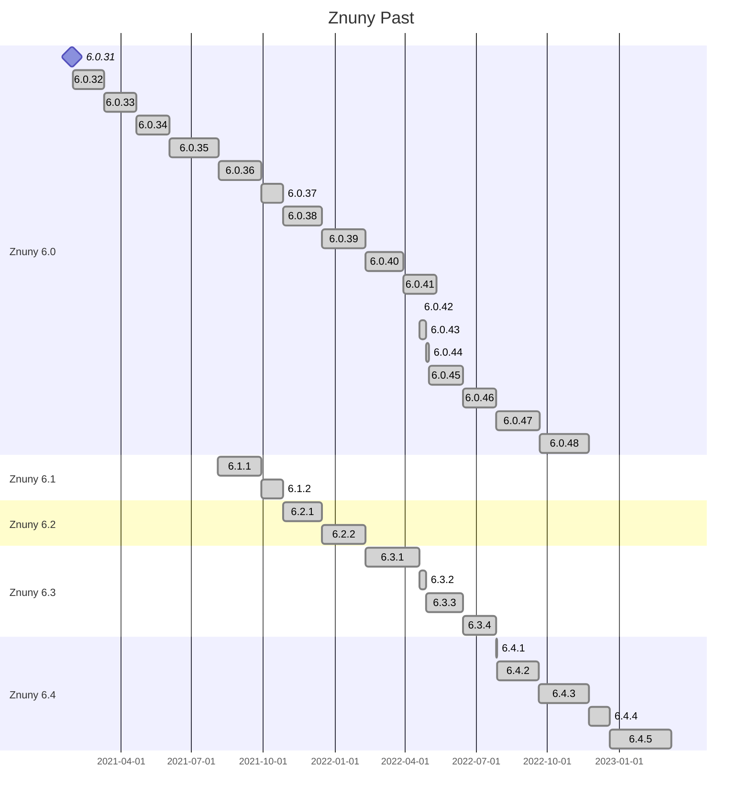
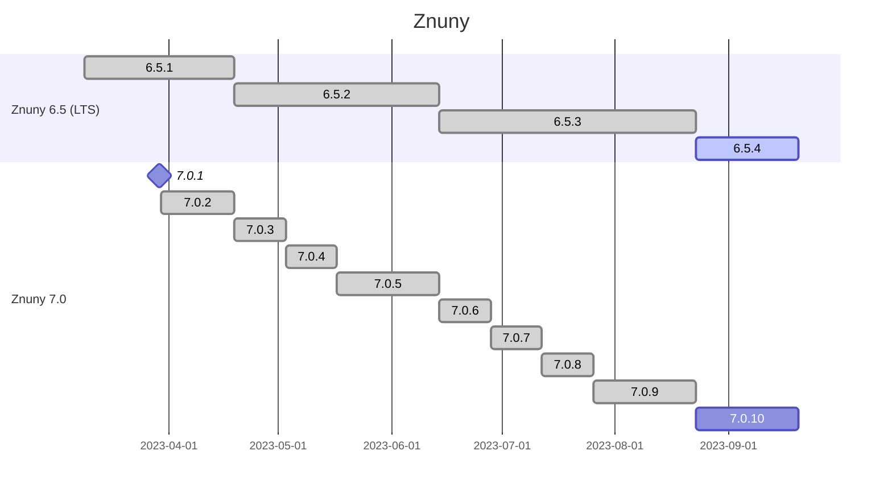

> Timeline was last updated on 31.08.2023.
{: .prompt-warning }

```mermaid
gantt
    title Znuny Past
    dateFormat  YYYY-MM-DD
    section Znuny 6.0
    6.0.31 :milestone, 6_0_31, 2021-01-27, 2021-01-29
    6.0.32 :done, 6_0_32, after 6_0_31, 2021-03-10
    6.0.33 :done, 6_0_33, after 6_0_32, 2021-04-21
    6.0.34 :done, 6_0_34, after 6_0_33, 2021-06-02
    6.0.35 :done, 6_0_35, after 6_0_34, 2021-08-05
    6.0.36 :done, 6_0_36, after 6_0_35, 2021-09-29
    6.0.37 :done, 6_0_37, after 6_0_36, 2021-10-27
    6.0.38 :done, 6_0_38, after 6_0_37, 2021-12-15
    6.0.39 :done, 6_0_39, after 6_0_38, 2022-02-09
    6.0.40 :done, 6_0_40, after 6_0_39, 2022-03-30
    6.0.41 :done, 6_0_41, after 6_0_40, 2022-05-11
    6.0.42 :done, 6_0_42, after 6_0_41, 2022-04-20
    6.0.43 :done, 6_0_43, after 6_0_42, 2022-04-28
    6.0.44 :done, 6_0_44, after 6_0_43, 2022-05-02
    6.0.45 :done, 6_0_45, after 6_0_44, 2022-06-15
    6.0.46 :done, 6_0_46, after 6_0_45, 2022-07-27
    6.0.47 :done, 6_0_47, after 6_0_46, 2022-09-21
    6.0.48 :done, 6_0_48, after 6_0_47, 2022-11-23

    section Znuny 6.1
    6.1.1 :done, 6_1_1, 2021-08-04, 2021-09-29
    6.1.2 :done, 6_1_2, after 6_1_1, 2021-10-27

    section Znuny 6.2
    6.2.1 :done, 6_2_1, 2021-10-27, 2021-12-15
    6.2.2 :done, 6_2_2, after 6_2_1, 2022-02-09

    section Znuny 6.3
    6.3.1 :done, 6_3_1, 2022-02-09, 2022-04-20
    6.3.2 :done, 6_3_2, after 6_3_1, 2022-04-28
    6.3.3 :done, 6_3_3, after 6_3_2,  2022-06-15
    6.3.4 :done, 6_3_4, after 6_3_3,  2022-07-27

    section Znuny 6.4
    6.4.1  :done,  6_4_1, 2022-07-27,  2022-07-28
    6.4.2  :done,  6_4_2, after 6_4_1,  2022-09-20
    6.4.3  :done,  6_4_3, after 6_4_2,  2022-11-23
    6.4.4  :done,  6_4_4, after 6_4_3,  2022-12-20
    6.4.5  :done,  6_4_5, after 6_4_4,  2023-03-09


```

```mermaid
gantt
    title Znuny
    dateFormat  YYYY-MM-DD

    section Znuny 6.5 (LTS)
    6.5.1 :done,   6_5_1, 2023-03-09,  2023-04-19
    6.5.2 :done,   6_5_2, after 6_5_1, 2023-06-14
    6.5.3 :done,   6_5_3, after 6_5_2, 2023-08-23
    6.5.4 :active, 6_5_4, after 6_5_3, 2023-09-20

    section Znuny 7.0

    7.0.1  :milestone,    7_0_1,  2023-03-29,      2023-03-30
    7.0.2  :done,         7_0_2,  after 7_0_1,      2023-04-19
    7.0.3  :done,         7_0_3,  after 7_0_2,      2023-05-03
    7.0.4  :done,         7_0_4,  after 7_0_3,      2023-05-17
    7.0.5  :done,         7_0_5,  after 7_0_4,      2023-06-14
    7.0.6  :done,         7_0_6,  after 7_0_5,      2023-06-28
    7.0.7  :done,         7_0_7,  after 7_0_6,      2023-07-12
    7.0.8  :done,         7_0_8,  after 7_0_7,      2023-07-26
    7.0.9  :done,         7_0_9,  after 7_0_8,      2023-08-23
    7.0.10 :active        7_0_10, after 7_0_9,   2023-09-20
```
