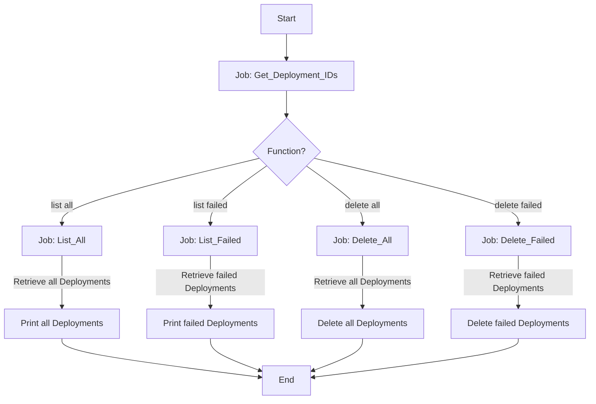

# Mastering Deployment Management with GitHub Actions

The [`deployment.yml`](https://github.com/dennykorsukewitz/dennykorsukewitz/blob/dev/.github/workflows/deployment.yml) file is a GitHub Actions workflow that automates the management of GitHub deployments. It allows users to list all deployments, list failed deployments, delete all deployments, and delete failed deployments.

> The graphic may differ from the current workflow.
{: .prompt-warning }

## Why is this so cool?

The beauty of this workflow lies in its automation capabilities. It takes tasks that would normally require manual intervention and time, and automates them, saving developers countless hours of work.

- **Efficiency**: Instead of manually managing deployments, this can be done automatically, saving time and reducing the chance of human error.
- **Visibility**: It provides a clear overview of all deployments or just the failed ones, making it easier to manage and troubleshoot them.
- **Cleanliness**: The ability to delete all or failed deployments helps keep your GitHub Actions clean and manageable. This is especially useful in large projects with many deployments, where manual cleanup would be tedious.

## Workflow Triggers

This workflow is triggered manually using the `workflow_dispatch` event. It accepts several inputs:

- `FUNCTION`: Determines the function to perform. Options include "list all", "list failed", "delete all", and "delete failed".
- `OWNER`: The owner of the repository.
- `REPOSITORY`: The repository where the deployments are located.
- `ENVIRONMENT`: The environment of the deployments. This input is optional.

## Jobs

The workflow consists of five jobs: `Get_Deployment_IDs`, `List_All`, `List_Failed`, `Delete_All`, and `Delete_Failed`.

A Personal Access Token (PAT) is only required for the `Delete_All` and `Delete_Failed` job. For all others, the normal GITHUB_TOKEN, which is stored in the `GITHUB_TOKEN` secret, is sufficient.

### Get_Deployment_IDs - Job

The `Get_Deployment_IDs` job is designed to retrieve the IDs of deployments in a specific GitHub repository. It has an output named `DEPLOYMENT_IDS`. This output can be used by other jobs in the workflow.

### List_All - Job

This job lists all deployments. It runs if the `FUNCTION` input is "list all". It uses the GitHub CLI (`gh`) to call the GitHub API and retrieve the deployments. The deployments are then printed to the console.

### List_Failed - Job

This job lists all failed deployments. It runs if the `FUNCTION` input is "list failed". Like the `List_All` job, it uses the GitHub CLI to call the GitHub API. However, it filters the deployments to only include those with a status of "failure", "inactive" or "error".

### Delete_All - Job

This job deletes all deployments. It runs if the `FUNCTION` input is "delete all". It retrieves the deployments using the GitHub API, then deletes each one using a DELETE request.

### Delete_Failed - Job

This job deletes all failed and inactive deployments. It runs if the `FUNCTION` input is "delete failed". It retrieves the deployments, filters for those with a status of "failure", "inactive" or "error", and then deletes each one.

## Conclusion

The `deployment.yml` workflow provides a powerful way to manage GitHub deployments. By using GitHub Actions and the GitHub API, it automates tasks that would otherwise need to be performed manually. However, it's important to use this workflow carefully, as deleting deployments cannot be undone.
