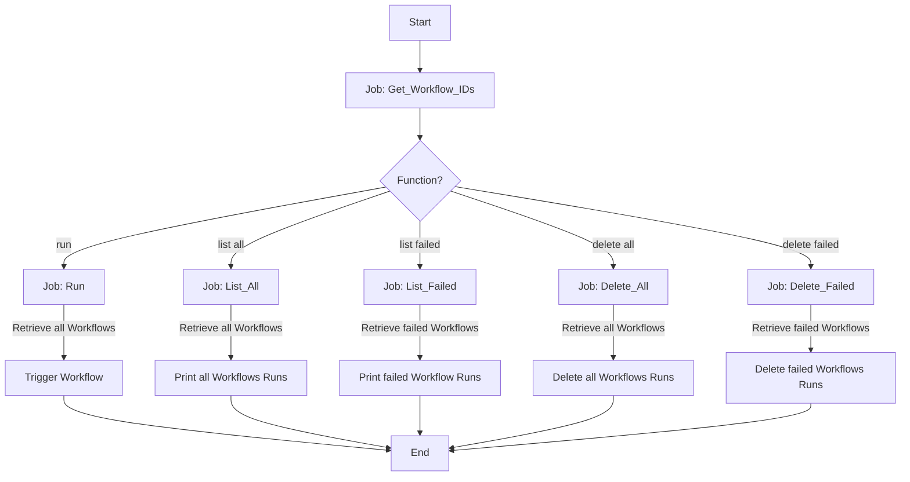

# Mastering Workflow Management with GitHub Actions

The [`workflow.yml`](https://github.com/dennykorsukewitz/dennykorsukewitz/blob/dev/.github/workflows/workflow.yml) file is a GitHub Actions workflow that provides a set of operations for managing GitHub Actions workflows in a repository. It supports running workflows, listing all or failed workflow runs, and deleting all or failed workflow runs.

> The graphic may differ from the current workflow.
{: .prompt-warning }

## Why is this so cool?

The beauty of this workflow lies in its automation capabilities. It takes tasks that would normally require manual intervention and time, and automates them, saving developers countless hours of work.

- **Efficiency**: Instead of manually triggering workflows, this can be done automatically, saving time and reducing the chance of human error.
- **Visibility**: It provides a clear overview of all workflows or just the failed ones, making it easier to manage and troubleshoot them.
- **Cleanliness**: The ability to delete all or failed workflow runs helps keep your GitHub Actions clean and manageable. This is especially useful in large projects with many runs, where manual cleanup would be tedious.

## Workflow Triggers

This workflow is triggered manually using the `workflow_dispatch` event. It accepts several inputs:

- `FUNCTION`: Determines the function to perform. Options include "run", "list all", "list failed", "delete all", and "delete failed".
- `OWNER`: The owner of the repository.
- `REPOSITORY`: The repository where the workflows are located.
- `WORKFLOW`: The specific workflow to operate on. If not specified, all workflows will be used.

## Jobs

The workflow consists of six jobs: `Get_Workflow_IDs`, `Run`, `List_All`, `List_Failed`, `Delete_All`, and `Delete_Failed`.

A Personal Access Token (PAT) is only required for the `Delete_All` job. For all others, the normal GITHUB_TOKEN, which is stored in the `GITHUB_TOKEN` secret, is sufficient.

### Get_Workflow_IDs - Job

The `Get_Workflow_IDs` job in your GitHub Actions workflow is designed to retrieve the IDs of workflows in a specific GitHub repository.
It has an output named `WORKFLOW_IDS`. This output can be used by other jobs in the workflow.

### Run - Job

This job runs the specified workflow(s). It runs if the `FUNCTION` input is "run". It uses the GitHub API to trigger the workflow(s).

### List_All - Job

This job lists all workflow runs. It runs if the `FUNCTION` input is "list all". It uses the GitHub API to retrieve the workflow runs and prints their IDs to the console.

### List_Failed - Job

This job lists all failed workflow runs. It runs if the `FUNCTION` input is "list failed". It uses the GitHub API to retrieve the workflow runs and filters them to only include those with a conclusion of "failure".

### Delete_All - Job

This job deletes all workflow runs. It runs if the `FUNCTION` input is "delete all". It retrieves the workflow runs using the GitHub API and filters them to only include those with a valid conclusion "!= null" and then deletes each one.

### Delete_Failed - Job

This job deletes all failed workflow runs. It runs if the `FUNCTION` input is "delete failed". It retrieves the workflow runs, filters for those with a conclusion of "failure", and then deletes each one.

## Conclusion

The `workflow.yml` workflow provides a powerful way to manage GitHub Actions workflows. By using GitHub Actions and the GitHub API, it automates tasks that would otherwise need to be performed manually. However, it's important to use this workflow carefully, as deleting workflow runs cannot be undone.
