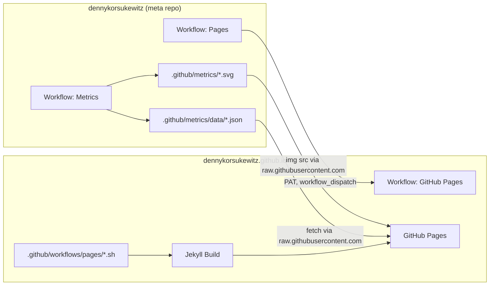

# Site Structure

The site is built with [Jekyll](https://jekyllrb.com/) and the [Chirpy](https://github.com/cotes2020/jekyll-theme-chirpy) theme v6.2.

Live: https://dennykorsukewitz.github.io  
Deploy branch: `dev`

## Architecture



## Directory layout

```
dennykorsukewitz.github.io/
├── _config.yml              # Jekyll config, theme, SEO, Giscus
├── _data/
│   ├── repositories.yml     # Repo list (generated)
│   ├── authors.yml
│   ├── contact.yml
│   └── share.yml
├── _includes/               # HTML partials (avatar, repos, topbar)
├── _layouts/                # Layouts (default, page, posts)
├── _plugins/                # Ruby plugins (e.g. lastmod hook)
├── _posts/                  # Blog posts (generated, gitignored)
├── _static/_posts/          # Static posts (source)
├── _tabs/                   # Navigation / page tabs
│   ├── metrics.md           # Charts + metrics SVGs (maintained manually)
│   ├── posts.md
│   ├── categories.md
│   ├── tags.md
│   ├── archives.md
│   └── repositories.md      # Generated
├── assets/
│   ├── css/                 # Theme overrides
│   ├── img/                 # Avatar, screenshots, favicons
│   └── lib/                 # Git submodule (Chirpy static assets)
├── index.html               # Home page (layout: home)
├── .github/workflows/
│   ├── pages.yml            # Build + deploy + screenshots
│   └── pages/*.sh           # Content generation
├── Dockerfile               # Local preview
└── docker-compose.yml
```

## Navigation (tabs)

Tabs live in `_tabs/` as a Jekyll collection. Sort order is controlled by `order` in front matter.

| Tab | File | Source |
| --- | --- | --- |
| Repositories | `_tabs/repositories.md` | Generated (`repositories_tab.sh`) |
| Posts | `_tabs/posts.md` | Jekyll collection |
| Categories | `_tabs/categories.md` | Jekyll archives |
| Tags | `_tabs/tags.md` | Jekyll archives |
| Archives | `_tabs/archives.md` | Jekyll archives |
| Metrics | `_tabs/metrics.md` | Manual |

Tab permalink: `/:title/` → e.g. `/metrics/`

## Generated content

During the Pages build, scripts in `.github/workflows/pages/` run:

| Script | Output |
| --- | --- |
| `delete.sh` | Removes old repo clones and `_posts/*` |
| `data.sh` | `_data/repositories.yml` |
| `github-profile.sh` | `index.md` from meta repo README |
| `repositories.sh` | Clones repos with topic `pages`, creates project pages |
| `repositories_tab.sh` | `_tabs/repositories.md` with badges and stats |
| `posts.sh` | Release posts in `_posts/` + copy from `_static/_posts/` |
| `monitoring.sh` | `monitoring.md` (badge overview) |
| `workflows.sh` | `workflows.md` (CI badge overview) |

Repos are discovered via GitHub search:

```bash
gh search repos --owner dennykorsukewitz --topic "pages"
```

To add a new project to the site: set the GitHub topic `pages`.

## Project pages

Each repo with topic `pages` is cloned and exposed as its own route, e.g.:

- `/VSCode-Znuny/` — repo README with Jekyll front matter

Markdown files in the cloned repo get front matter automatically (`layout: page`, `repository`, `tags`).

## Metrics page

`_tabs/metrics.md` combines:

1. **Chart.js charts** — load JSON from the meta repo:
   - `daily.json`, `vscode-total.json`, `sublime-total.json`, `npm-total.json`, `github-stars.json`
   - Base URL: `https://raw.githubusercontent.com/dennykorsukewitz/dennykorsukewitz/dev/.github/metrics/data/`

2. **SVG charts** (lowlighter/metrics) — also from the meta repo:
   - `sponsors.svg`, `languages.indepth.svg`, `comment.reactions.svg`, `commit-calendar.total.svg`

3. **`repositoryColors`** — fixed color mapping per repo in `metrics.md`

## Git submodule

```bash
assets/lib → https://github.com/cotes2020/chirpy-static-assets.git
```

Chirpy theme assets. Initialize once:

```bash
git submodule update --init --recursive
```

## GitHub Actions (github.io)

**`.github/workflows/pages.yml`**

- Trigger: push to `dev`, manual
- Steps: content scripts → Ruby/Jekyll build → GitHub Pages deploy → screenshots

After deploy: `screenshots.sh` creates dark/light screenshots under `assets/img/screenshots/`.

## Related meta repo

In the `dennykorsukewitz` repo:

| Workflow | Purpose |
| --- | --- |
| `metrics.yml` | Collect SVG + JSON, commit to `dev` |
| `pages.yml` | Triggers Pages build in github.io via PAT |

Metrics JSON is **not** copied into the github.io repo — the metrics page loads it live from GitHub raw.
