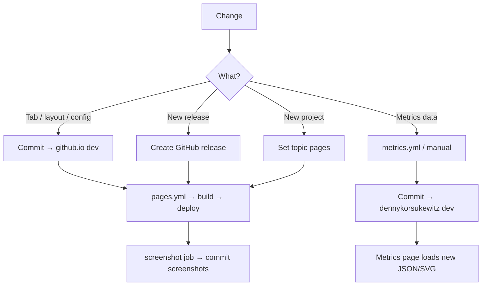

# Updating

How to refresh content, metrics, and deployments.

## Overview



## 1. Manual site content

Edit files directly in `dennykorsukewitz.github.io`:

| Area | File(s) |
| --- | --- |
| Metrics charts, colors | `_tabs/metrics.md` |
| Static blog posts | `_static/_posts/*.md` |
| Theme/CSS | `assets/css/jekyll-theme-chirpy.scss` |
| Layout/includes | `_includes/`, `_layouts/` |
| Site config | `_config.yml` |
| Home page | `index.html` |

Preview locally: [Docker](docker.md)

Deploy:

```bash
git add .
git commit -m "Describe change"
git push origin dev
```

A push to `dev` triggers `.github/workflows/pages.yml` automatically.

## 2. Add a new project to the site

1. Create the repository on GitHub
2. Set topic `pages` (Settings → Topics)
3. Maintain README.md in the repo
4. Run the Pages workflow (push to `dev` in github.io or trigger manually)

Result:

- Entry in `_tabs/repositories.md`
- Dedicated page at `/{repo-name}/`
- Release posts for each GitHub release

Remove the topic → project disappears on the next build (after `delete.sh`).

## 3. Release posts

Posts are generated **automatically** from GitHub releases (`posts.sh`):

- Source: `gh release list` per repo with topic `pages`
- Latest release: `pin: true`
- Additionally: static posts from `_static/_posts/`

Manual post without a release: add a file in `_static/_posts/` with standard front matter:

```yaml
---
layout: post
title: "My Post"
date: 2026-06-20 12:00:00 +0200
categories: [DK4]
tags: [example]
---
```

## 4. Update metrics

Metrics live in the **`dennykorsukewitz`** repo, not in github.io.

### Automatic (GitHub Actions)

Workflow: `dennykorsukewitz/.github/workflows/metrics.yml`

- Schedule: daily at 06:00 UTC
- Manual: Actions → Metrics → Run workflow

Jobs:

| Job | Output |
| --- | --- |
| Personal, Languages, Calendars, … | `.github/metrics/*.svg` |
| NPM, Sublime, VSCode, Stars | `.github/metrics/data/*.json` |
| Daily | `daily.json` (aggregated) |
| Download-And-Commit | Commits everything to `dev` |

Required secrets in the meta repo:

| Secret | Used for |
| --- | --- |
| `METRICS_TOKEN` | lowlighter/metrics (GitHub API) |
| `VSC_PAT` | VS Code Marketplace API |

### Regenerate metrics locally

In the `dennykorsukewitz` meta repo:

```bash
# All metrics scripts
bash .github/workflows/metrics/metrics.sh
```

Individual scripts:

```bash
bash .github/workflows/metrics/github.sh
bash .github/workflows/metrics/sublime.sh
bash .github/workflows/metrics/vscode.sh   # requires VSC_PAT
bash .github/workflows/metrics/npm.sh
bash .github/workflows/metrics/daily.sh    # requires prior JSON files
```

Commit JSON and push to `dev` — the metrics page will load the new data.

### Change chart colors

In `_tabs/metrics.md`:

```javascript
const repositoryColors = {
    'VSCode-Znuny': '#85C1E9',
    // ...
};
```

The repo name must match the JSON key exactly. Do not use `forceOverride: true` in the Chart.js `colors` plugin — it overrides custom colors.

## 5. Pages build (production)

### Automatic

Push to `dev` in `dennykorsukewitz.github.io` → `pages.yml`

Additionally: push to `dev` in `dennykorsukewitz` → `pages.yml` triggers the github.io build via PAT.

### Manual

GitHub → `dennykorsukewitz.github.io` → Actions → **GitHub Pages** → Run workflow

### Local (full CI-like build)

Requirements: `gh`, `jq`, GitHub token

```bash
cd dennykorsukewitz.github.io

# Generate everything
bash .github/workflows/pages/pages.sh

# Build Jekyll (with Docker)
docker compose run --rm site bundle exec jekyll build
# or: docker compose up and check in the browser
```

Individual steps:

```bash
bash .github/workflows/pages/data.sh              # repositories.yml
bash .github/workflows/pages/repositories_tab.sh  # Repositories tab
bash .github/workflows/pages/posts.sh             # Release posts
bash .github/workflows/pages/repositories.sh      # Clone repo pages
```

## 6. Screenshots

After each deploy: **Screenshot** job in `pages.yml`

- Tool: `capture-website-cli`
- Output: `assets/img/screenshots/Screenshot-*.png`
- Commit message: "Updated Screenshots."

Run manually locally (with server running):

```bash
npm install --global capture-website-cli
bash .github/workflows/pages/screenshots.sh
```

## 7. Update submodules

Chirpy static assets:

```bash
git submodule update --remote assets/lib
git add assets/lib
git commit -m "Update Chirpy static assets"
```

## Checklist: common tasks

| Task | Action |
| --- | --- |
| Text/design on metrics page | `_tabs/metrics.md` → push `dev` on github.io |
| New VS Code extension release | GitHub release → Pages build |
| Refresh metrics charts | Wait for `metrics.yml` or trigger manually |
| List new repo | Set topic `pages` → Pages build |
| Test locally | `docker compose up` |
| Check production | https://dennykorsukewitz.github.io/metrics/ |

## Secrets (github.io)

| Secret | Usage |
| --- | --- |
| `PAT` | GitHub API in build scripts, submodule/clone |

Secrets are stored in GitHub → Repository Settings → Secrets and variables → Actions.
